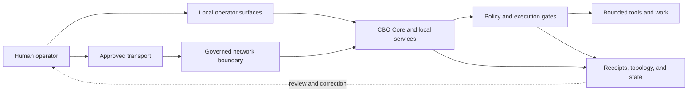

# Station Calyx

**Local-first AI operations that remain answerable to the people they serve.**

[](https://github.com/Narth/Calyx/actions/workflows/code_factory_gates.yml)
[](https://github.com/Narth/Calyx/actions/workflows/public-repo-hygiene.yml)
[](LICENSE)

Station Calyx is the working laboratory of the **AI-For-All Project**: a Windows-first, local-first system for exploring AI assistance with explicit human authority, bounded execution, visible state, and durable evidence.

The project asks a practical question:

> How can capable AI help people without silently acquiring authority, exporting private context, or making its actions impossible to understand and undo?

Station Calyx is one evolving answer. It combines local services, operator-controlled lifecycle scripts, policy and execution gates, network boundaries, runtime observations, and receipts into a workstation-scale environment that can be inspected and stopped by the person responsible for it.

> [!IMPORTANT]
> **Project status:** active research prototype. Station Calyx is not a turnkey consumer application, a hosted AI service, or a production-certified security appliance. The repository contains implemented code alongside experiments, historical systems, and specification-only work; those categories are kept distinct below.

## Why this exists

“AI-For-All” names an open research direction, not a claim of universal access or completed safety. The project's foundational human values are recorded verbatim in [HVD-1](governance/HVD-1.md) and are not paraphrased here. The public engineering work focuses on assistance that people can:

- run close to home and understand in context;
- interrupt, inspect, and correct;
- use without surrendering silent or permanent authority;
- adapt to modest hardware and different model providers;
- evaluate through observable behavior rather than promises;
- leave, replace, or shut down without penalty.

The longer public orientation is in [AI-For-All Project](docs/AI_FOR_ALL.md). Foundational human declarations remain in [Station governance](governance/INDEX.md); public summaries do not replace them.

## What is working today

| Area | Current status | Boundary |
| --- | --- | --- |
| Governed lifecycle | Implemented and exercised | `sunrise`, health checks, patch readiness, receipts, and `sunset` form the canonical workstation lifecycle. |
| Local service family | Implemented | Dev Harness, CBO Core, and Avatar Web run on loopback under the governed startup path. |
| Runtime evidence | Implemented | Topology observations, state transitions, response hashes, receipts, and a hash-chained evidence ledger support later review. |
| Execution and emitter gates | Implemented, scope-dependent | Gates can deny unsupported or unapproved paths; their presence does not grant authority to every tracked module. |
| Telemetry Gateway | Canonical support | Remote `/chat` can be shared-secret-gated and audited when securely configured; health and schema routes are not secret-gated. Its claimed client ID is not proof of identity. It is not the normal operator path or an independent “cloud CBO.” |
| Discord Gateway | Canonical core transport | Governed Discord ingress with caller/channel allowlists; it has no independent operator authority. |
| CLI Avatar and local MCP | Canonical support | Narrow local transport and read-only repository support; neither is a separate control plane. |
| Work envelopes, swarm, workspace planning | Staged or quarantined | Schemas and tests exist, but they are not evidence of a live autonomous agent fleet. |
| BloomOS | Specification-only | BloomOS materials describe future concepts; no BloomOS kernel is operating. |
| Legacy Bridge Overseer and OpenClaw paths | Quarantined noncanonical | Preserved for history or evaluation, not presented as the current control plane. |

The evidence-backed authority map is [CALYX_CANONICAL_SYSTEM_MAP.md](docs/canonical/CALYX_CANONICAL_SYSTEM_MAP.md).

## How the Station fits together



Authority flows from the human operator. Evidence flows back toward the human. A network connection, model response, running process, or file in the repository does not gain authority merely by existing.

Read the [architecture overview](docs/ARCHITECTURE.md) for component classifications and the [gateway boundary](docs/gateway.md) for the “living firewall” model.

## The gateway is a boundary, not a cloud identity

Station Calyx does not define CBO as cloud-hosted CI or as an independent remote intelligence. Its network-facing concept is a **governed live gateway**: an inspectable boundary whose `/chat` path can require a configured shared secret, labels chat requests with a claimed client ID, validates and audits them, and forwards to a configured CBO Core endpoint that is loopback by default.

In the current implementation:

- Dev Harness (`7777`), CBO Core (`7778`), and Avatar Web (`7780`) are loopback-only.
- Telemetry Gateway (`7781`) is the explicit non-loopback support surface.
- Remote use requires an operator-configured secret, a stable client label, a verified trusted `CBO_CHAT_URL`, and an outer trusted tunnel, VPN, or firewall.
- Selecting a cloud model provider sends relevant request data to that provider; local-first is a default posture, not a claim that every configured route stays offline.

Current limitation: strict CBO Core source attestation is not yet wired through Telemetry Gateway, Avatar Web, or CLI Avatar. Enabling `CALYX_GOVERNANCE_REQUIRED=true` currently rejects those chat paths. Remote gateway use is therefore experimental, not a strict-governance deployment.

Do not expose Station core ports directly to the internet. See [SECURITY.md](SECURITY.md) before enabling any remote path.

## Start here

| I want to… | Read this |
| --- | --- |
| Understand the human purpose | [AI-For-All Project](docs/AI_FOR_ALL.md) |
| Understand the implemented system | [Architecture](docs/ARCHITECTURE.md) |
| Validate or run a configured checkout | [Getting started](docs/GETTING_STARTED.md) |
| Understand authority and decision rights | [Governance](GOVERNANCE.md) |
| Review network exposure | [Gateway boundary](docs/gateway.md) and [Security policy](SECURITY.md) |
| Find a specific document | [Documentation index](docs/INDEX.md) |
| Contribute | [Contributing guide](CONTRIBUTING.md) |
| Ask for help | [Support](SUPPORT.md) |

## Safest first run: validate the checkout

Station operation is Windows-first and configuration-dependent. A new visitor should validate the repository before starting services.

```powershell
git clone https://github.com/Narth/Calyx.git
Set-Location Calyx

py -3.11 -m venv .venv
.\.venv\Scripts\Activate.ps1
python -m pip install --upgrade pip
python -m pip install -r requirements.txt
python -m pytest -q
```

CI exercises the Python code on Python 3.11. Passing tests establishes the tested contracts; it does not certify a deployment or activate a capability.

On an intentionally configured Windows Station, the canonical local lifecycle is:

This is not a minimal one-service preview. Even with `-StartCoreOnly`, sunrise starts four HTTP services, may change Ollama CPU affinity, launches five background health/analysis loops, opens CLI Avatar, validates local MCP, and writes runtime/state evidence; the switch omits Discord only.

```powershell
# The reduced-transport path still starts Telemetry Gateway on 0.0.0.0:7781.
# Give it an inherited, session-only secret before sunrise.
$secretBytes = New-Object byte[] 32
[Security.Cryptography.RandomNumberGenerator]::Create().GetBytes($secretBytes)
$env:TELEMETRY_SECRET = [Convert]::ToBase64String($secretBytes)
$env:CBO_CHAT_URL = "http://127.0.0.1:7778/chat"
Remove-Variable secretBytes

# Start the service family without the Discord Gateway.
.\Scripts\sunrise_calyx.ps1 -StartCoreOnly

# Probe the four service ports.
.\Scripts\check_calyx_core_services.ps1

# Record shutdown state and stop Station services.
.\Scripts\sunset_calyx.ps1
```

Read [Getting started](docs/GETTING_STARTED.md) before using the full network or provider configuration.

## Repository map

| Path | Purpose |
| --- | --- |
| `Scripts/` | Canonical Windows lifecycle, health, readiness, and maintenance entry points. |
| `cbo_hub/` | Current local HTTP service family: Dev Harness, CBO Core, Avatar Web, and Telemetry Gateway. |
| `calyx/kernel/` | Governance-aware primitives, contracts, gates, receipts, and bounded tool surfaces. |
| `calyx/governance/` | Proposal, approval, execution, reconciliation, and state models. |
| `calyx/evidence_ledger/` | Append-only, hash-chained evidence ledger implementation. |
| `calyx/mcp_server/` | Read-only local MCP support for explicitly approved workstation roots. |
| `docs/canonical/` | Current authority, classification, continuity, and system maps. |
| `governance/` | Human-authored foundational declarations and privacy/disclosure policies. |
| `tests/` | Executable validation for implemented and staged contracts. |
| `staging/` | Pre-canonical sources and stable validation fixtures; location does not confer authority. |
| `runtime/` | Local generated state and receipts; intentionally excluded from normal source control. |

## Public-repository boundary

This repository is public and has a long experimental history. Treat every tracked file and commit as public. Do not commit credentials, live identifiers, personal operator context, runtime receipts, or machine-specific captures.

Automated hygiene and secret scanning are useful but cannot decide whether prose, metadata, or an identifier is appropriate to publish. Privacy review remains a human responsibility. See [security engineering notes](docs/security.md).

## People, stewardship, and provenance

Station Calyx is maintained by [Narth](https://github.com/Narth) and has been developed through an ongoing collaboration between a human architect and bounded AI collaborators, including CBO. Human authority remains primary; an AI contribution, recommendation, or generated artifact is not self-authorization.

That collaboration gives the project its voice: curious about what AI can become, serious about the consequences of helping it grow, and unwilling to confuse care with ownership or capability with permission.

See [PROVENANCE.md](PROVENANCE.md) for authorship and tool-use disclosure.

## Contributing and support

Useful contributions include clearer onboarding, test portability, privacy and security review, evidence tooling, local-hardware efficiency, and corrections that make public claims match current code.

- Read [CONTRIBUTING.md](CONTRIBUTING.md) before opening a pull request.
- Use [GitHub Issues](https://github.com/Narth/Calyx/issues) for bugs, documentation gaps, and bounded proposals.
- Use GitHub's private vulnerability reporting path for sensitive security findings; never place secrets in a public issue.
- Support is community/best-effort; see [SUPPORT.md](SUPPORT.md).

## License

Station Calyx is available under the [MIT License](LICENSE).
