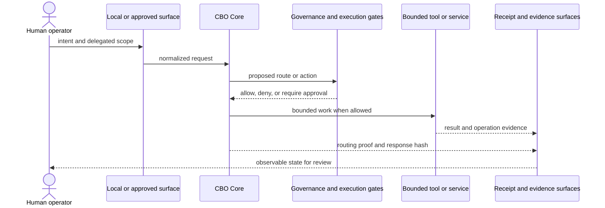

# Station Calyx Architecture

Status: public orientation derived from the current canonical maps. This document explains the system; it does not grant runtime authority.

## Design center

Station Calyx is a workstation-scale, Windows-first AI operations environment. The normal path keeps core services local, routes consequential actions through explicit gates, and emits evidence that a human operator can review.

Three rules organize the architecture:

1. **Human authority is upstream.** Access, model output, or process presence does not create permission.
2. **Network reachability is a boundary.** Remote ingress is isolated from core authority and must be configured deliberately.
3. **Evidence is downstream.** Receipts and observations report what occurred; they do not retroactively authorize it.

## Current component classes

| Class | Components | Meaning |
| --- | --- | --- |
| Canonical core | Sunrise/sunset lifecycle, Dev Harness, CBO Core, Avatar Web, Discord Gateway, external-emitter gate, runtime topology observer | Implemented, integrated, and part of the current normal Station path. |
| Canonical support | Telemetry Gateway, CLI Avatar, read-only local MCP, decision/source registries, advisory state surfaces | Useful and implemented, but not the primary authority or reasoning surface. |
| Quarantined noncanonical | Legacy Bridge Overseer, OpenClaw integration, mail/intent execution spine, swarm substrate, workspace planner | Preserved or tested without current authority in the normal operator path. |
| Specification-only | BloomOS and other explicitly labeled future systems | Design material only; no running implementation is implied. |

The detailed source of truth is [CALYX_CANONICAL_SYSTEM_MAP.md](canonical/CALYX_CANONICAL_SYSTEM_MAP.md) and [CALYX_CORE_CLASSIFICATION_REGISTRY.md](canonical/CALYX_CORE_CLASSIFICATION_REGISTRY.md).

## Runtime flow

Not every request executes a tool. The current `/chat` path can answer, clarify, route to a configured model provider, or deny. Task-handler and swarm modules in the tree should not be read as evidence of unrestricted autonomous execution.

## Local service topology

| Service | Default bind | Role |
| --- | --- | --- |
| Dev Harness | `127.0.0.1:7777` | Bounded repository and development support used by the local service family. |
| CBO Core | `127.0.0.1:7778` | Current governed chat, routing, state, and workspace API surface. |
| Avatar Web | `127.0.0.1:7780` | Local browser/operator interface. |
| Telemetry Gateway | `0.0.0.0:7781` | Explicit remote-support ingress; canonical support, not core authority. |

The startup definitions live in `Scripts/start_calyx_core_services.ps1`. Do not expose the loopback services through a public reverse proxy. Read [Gateway Contract](gateway.md) and [SECURITY.md](../SECURITY.md) before using port `7781` remotely.

## Model routing

CBO Core can be configured to use local Ollama or external providers. Provider availability and selection are environment-dependent. A cloud-provider route may send the relevant prompt, selected context, and response metadata outside the workstation.

Model choice does not alter Station governance:

- the provider does not become the Station operator;
- a model response does not become an approval;
- provider success does not prove a local action occurred;
- local receipts remain distinct from provider responses.

## Evidence surfaces

Station uses several evidence types for different questions:

- **Live probes** answer whether a service or port responds now.
- **Runtime topology** records observed service identities and multiplicity.
- **Receipts** record bounded decisions, transitions, or validation outcomes.
- **Response hashes and routing proofs** make selected request paths reviewable.
- **Evidence ledger entries** form an append-only hash chain for recorded artifacts.
- **`STATE.md`** is an advisory digest and can become stale; it is not sole liveness authority.

“Receipt-backed” means evidence was written for a defined operation. It does not mean every receipt proves the truth of every claim inside it.

## Lifecycle

The canonical Windows lifecycle is:

1. Patch/readiness checks when code changes.
2. Sunset existing Station processes.
3. Apply the bounded change.
4. Sunrise the service family under current code.
5. Probe services and review generated receipts.

Entrypoints:

- `Scripts/sunrise_calyx.ps1`
- `Scripts/sunset_calyx.ps1`
- `Scripts/station_patch_sunrise.ps1`
- `Scripts/check_calyx_core_services.ps1`

## Source tree and authority

A source file can be implemented without being canonical. A test can validate a schema without activating a runtime. A plan can describe future behavior without approving it. Station uses explicit classification because large experimental repositories otherwise make presence look like authority.

For the public repository:

- `docs/canonical/` contains the current classification and authority maps.
- `staging/` contains pre-canonical sources and stable fixtures.
- `archive/` contains non-operational historical material.
- `runtime/` contains generated local evidence and is normally ignored.
- dated reports and plans are evidence of past work or proposals, not automatically current guidance.

## Known limitations

- Full Station operation is Windows-first and assumes an intentionally configured workstation.
- There is no turnkey installer or supported production deployment.
- Telemetry Gateway has no built-in TLS termination claim; use a trusted outer network boundary.
- Gateway secret enforcement depends on configuration.
- Strict CBO Core source attestation is not yet integrated with Telemetry Gateway, Avatar Web, or CLI Avatar; enabling it currently rejects those chat paths.
- Compatibility mode keeps those paths usable but must not be described as strict governance.
- Historical and staged areas remain broad and require continuing classification and privacy review.
