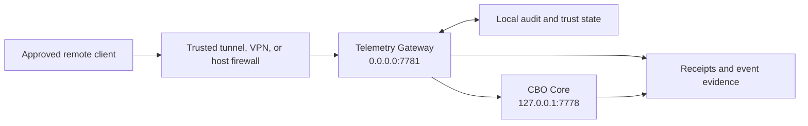

# Governed Network Gateway

Status: implemented canonical support surface. It is not the normal operator path, an independent control plane, or a cloud-hosted CBO identity.

## The “living firewall” model

Telemetry Gateway is best understood as a living firewall for Station interaction: a narrow, inspectable boundary that can decide whether a request is admissible, label and namespace caller context, confirm an audit record, and forward to a configured CBO Core endpoint that is loopback by default.

“Living” means the boundary responds to a claimed client label, audit appendability, and Station observe-only state. “Firewall” means it should reduce and expose authority—not become an invisible tunnel around it.

The gateway does not think independently, own Station identity, approve work, or turn network access into operator authority.

## Current topology



Core services remain local:

- Dev Harness: `127.0.0.1:7777`
- CBO Core: `127.0.0.1:7778`
- Avatar Web: `127.0.0.1:7780`

Only Telemetry Gateway is configured to bind beyond loopback, on `0.0.0.0:7781`.

## Exposed routes

### `GET /health`

Sends `GET /` to the hard-coded local address `http://127.0.0.1:7778/` and treats any HTTP response as local CBO Core reachability. It does not probe the configured `CBO_CHAT_URL` or prove that `/chat` forwarding will work. The route is currently unauthenticated and includes the gateway audit trust state.

### `POST /chat`

Accepts a CBO Core chat request, namespaces its session by client ID, confirms a local pre-forward audit append, and forwards the request to `CBO_CHAT_URL`. The default is `http://127.0.0.1:7778/chat`; configuration can point elsewhere.

Required header:

```text
X-Telemetry-Client-ID: stable_client_name
```

When `TELEMETRY_SECRET` is configured, also provide either:

```text
X-Telemetry-Secret: <secret>
```

or:

```text
Authorization: Bearer <secret>
```

Example bounded request:

```json
{
  "user_text": "Report current Station status and cite the evidence used.",
  "session_id": "operator-check",
  "mode": "observe",
  "allow_tools": false,
  "model_role": "none"
}
```

The gateway replaces the supplied session ID with a delimiter-based namespaced value. The client ID is self-asserted, and specially chosen client/session pairs can produce the same composed value. Treat this as ordinary context hygiene, not authenticated tenant isolation.

The current gateway accepts any JSON object and relies on CBO Core for downstream field validation. It has no gateway-level rate limit, request-body size limit, or explicit field allowlist.

### Schema and documentation routes

The current FastAPI application also exposes `/docs`, `/redoc`, and `/openapi.json` by default. Restrict or disable them at the application or trusted outer boundary for remote deployments.

## Admission and audit behavior

The current gateway:

- requires a syntactically valid client ID;
- checks the configured telemetry secret when one exists;
- denies `/chat` forwarding when its audit trust state is untrusted;
- denies forwarding when Station observe-only mode is forced;
- hashes the request body for the audit record;
- requires a confirmed pre-forward local audit append;
- records downstream outcome after forwarding;
- on Windows, starts `Scripts/update_state_checks.ps1` in the background after every successful forward;
- downgrades audit trust if post-forward recording fails.

These are meaningful controls, but they are not a complete public-edge security stack.

In this implementation, “audit trust state” means the gateway established its local audit path and can confirm appends. It does not authenticate a caller, validate the truth of a record, or establish that forwarded metadata came from a trusted source.

The post-success state refresh can update `STATE.md` and runtime evidence. Request fields such as `mode: "observe"` and `allow_tools: false` constrain the downstream chat request; they do not suppress this gateway side effect.

## Audit data and retention

The audit JSONL can include a claimed client label, `forwarded_for` metadata, session labels or hashes, request hashes, status, downstream outcome, and error details. These fields can be identifying or operationally sensitive even when the request body itself is not stored. The gateway records a supplied `X-Forwarded-For` value without establishing its authenticity; treat it as untrusted unless a trusted outer proxy strips and replaces that header.

The current gateway does not claim automatic rotation for this file. Operators must define and enforce a bounded retention process, protect the file locally, and reconcile actual storage with [DRP-1](../governance/DRP-1.md). This documentation makes no claim that the current path is retention-compliant by default.

## Strict-governance compatibility limit

Telemetry Gateway currently forwards JSON without the trusted-source headers required by CBO Core when `CALYX_GOVERNANCE_REQUIRED=true`. Avatar Web and CLI Avatar have the same integration gap. Strict mode therefore rejects these chat paths with `403`; compatibility mode must not be represented as equivalent governance.

Until source attestation is integrated end to end, treat remote gateway use as an experiment and not as a strict-governance deployment for consequential work.

## Required safeguards for any remote experiment

Before any remote use:

1. Set `TELEMETRY_SECRET` to a strong non-empty value.
2. Accept the strict-governance compatibility limit above; do not use the path for consequential remote operations.
3. Put the gateway behind a trusted tunnel, VPN, or restrictive host/network firewall.
4. Terminate TLS in that trusted outer boundary.
5. Limit port `7781` to approved source networks or peers.
6. Confirm `CBO_CHAT_URL` remains loopback or points to an explicitly trusted endpoint.
7. Use a unique stable client label per caller/device, without treating it as authentication.
8. Restrict or disable the unauthenticated health and schema/documentation routes at the outer boundary.
9. Confirm the audit path is local, writable, protected, and governed by a bounded retention process.
10. Review which model provider CBO Core may call.
11. Test revocation and governed sunset before relying on the path.

> [!CAUTION]
> If `TELEMETRY_SECRET` is empty, the current implementation does not require a secret. A client ID alone is not authentication. Do not make port `7781` remotely reachable in that state.

## What must never be exposed

Do not directly expose ports `7777`, `7778`, or `7780`. Do not forward arbitrary client-supplied paths. Do not place secrets or live client identifiers in tracked configuration or documentation.

## Cloud and provider boundary

The gateway runs as part of the Station environment. It is not “CBO in the cloud.” A separate tunnel or cloud relay may carry traffic, and CBO Core may call a cloud model when configured, but those services do not become Station authority.

Cloud model selection can disclose relevant request content to the provider. That disclosure should be visible to the operator and separate from the gateway's local audit claim.

## Verification

Relevant implementation:

- `cbo_hub/telemetry_gateway/app.py`
- `Scripts/start_calyx_core_services.ps1`
- `docs/STATION_STACK_POLICY.md`
- `tests/test_runtime_topology_visibility.py`

Security reporting and limitations are in [SECURITY.md](../SECURITY.md).
